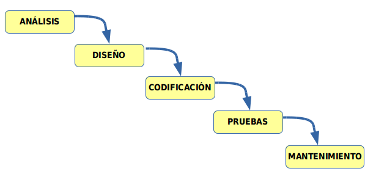
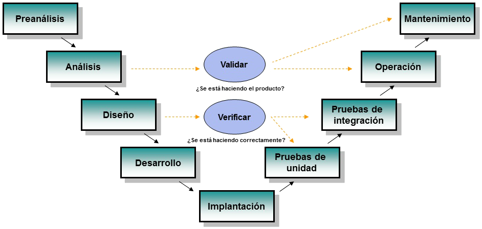
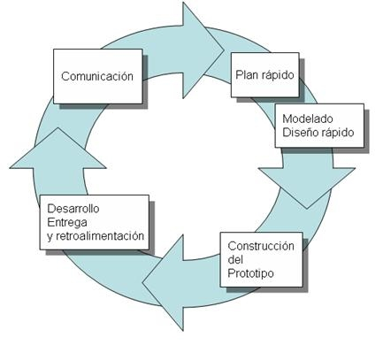
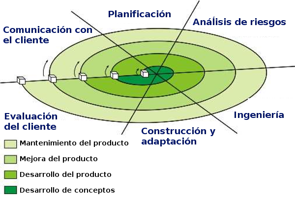

# Apunts_UF1_1
## Tipus de Software
Software  |Explicació  
--|--
**De sistema**  |  Sistema operatiu, drivers.
**D'aplicació**  |   Navegador, Suite ofimatica, edició d'imatges.
**De desenvolupament**  |  Editors de codi, compliadors.

## Relació de hardware-software
- **Disc Dur:** Enmagatzema les dades de l'ordinador, comfitxers, programes...
- **Memoria Ram:** Enmagatzema de forma temporal els arxius executables de codi bianri.
- **CPU:** LLegeix i executa les instruccions enmagatzemades a la memoria RAM.
- **E/S:** Agafa les dades dels dispositius d'entrada i el mostren per pantalla o es guarden al disc dur.

## Codi font, objecte i executables
Codi  |Explicació  
--|--
**Font**  | Arxiu escri ten un llenguatje de programació, com java,python...
  **Objecte**|És l'arxiu binari no executable .
  **Executable**|  Arxiu binari executable.

## Cicle de vida del Software
### Fases principals de desenvolupament de software    
      Analisi: Es diuen i es determinen les necessitats del client i s'especififca els requisits que ha de cumplir el software.

      Diseny: S'organiza el software en elements així poden ser desenvolupats per separats. S'especififca la funcionalitat del elements del software.

      Codificació: S'escriu el codi font del software.

      Probes: L'objectiu de les probes ha de ser de que el software funcioni correctament i s'hi descobreixin errades.

      Manteniment: Un cop el software s'ha llançant , es va fent manteniment per a pdoer tenir actualitzat el software i corregir errades.

Hi han diferents tipus de manteniments:

Manteniment  |  Explicació
--|--
**Correctiu**  | És corritgeixen el defectes  
**Perfectiu**  | És mijora la funcionalitat  
**Evolutiu**  | S'afegeixen noves funcionalitats  
**Adaptatiu**  |S'adapta a nous entorns  

## Model de desenvolupament de software

### Models clasics:
**Model en cascada:**  Les fases s'han de realitzar en un orde indicat i no és pot pasar a la següent fase sense a ver acabat la fas anterior.

**Model en V:** Els nivells superirors són més generals, al conrari que als nivells inferiros que són de més detall.

### Model de constroucció de prototips
**Prototip:**  A vegades els requisits no estan especificats. És crea un prototip durant la fase de analisi i és provat per l'usuari per a definir els requeriments. Hi han dos tipus de prototip:

    Prototip ràpid: El prototip pot esta desenvolupat en un altre llenguatje de programació o amb altres eines del projecte. Finalment aquest prototip és desfa.

    Prototip evolutiu: El prototip està desenvolupat amb el mateix llenguatje de programació i amb les mateixes eines del projecte. S'utilitza com a base per a desenvolupar el projecte.

### Models evolutius o incrementals
**Model en espiral:** L'activita d'engenyeria correspon als models clasics: analisi, diseny, codificació, proves, manteniment.

**Metodologia àgil:** Els requisits i les solucions evolucionen amb el temps segons la necesitat del projecte. El treball és realitzat mitjançant equips auto-organitzats. Les metodoligies més conegudes són:

    - Kanban
    - Scrum
    - XP (eXtreme Programming)

## Llenguatjes de programació

Per a obtenir el codi binari tenim dos opcions:

    Compiliar.
    Interpretar.

**Lenguatje compilat:** És tradueix el codi a un arxiu binari. Exemple : C, C++

      Ventatge: Execució molt eficient.
      Desventatge: És nnecessari compilar-ho sempre que és modifiqui el codi.

**Llenguatje interpretat:** L’interpret executa el codi línea per línea. Exemple : Java, PHP.

      Ventatge: El codi font s'interpreta directament.
      Desventatge: L'execució és menys eficient.

### Tipus de llenguatje

Segons la forma que operen poden ser:

**Decalaratius:** Indiquen el resultat sense especificar els pasos a seguir. Utilitzen llenguatjes amb regles tipu prolog, amb sentencies com SQL o amb funcion com Lisp. Normalmente son llenguatjes interpretats.

**Imperatius:** Indiquen els pasos  a seguir que hem fet per a obtenir el resultat. Normalment s’utilitza per a programar de forma estrucutrada com c, orientats a objectes com java. Molt d’ells són llenguatjes compilats.

Segons al nivell que trebajen:

**Baix nivell:** Ensamblador.

**Alt nivell:** C++, Java.
### Procés de compilació / interpretació

**Anàlisi lexic:** Mira línea per línea que estigui tot bé.

**Anàlisi sintactic:** Mira que el codi en general estigui ben escrit.

### Criteris per a la selecció d'un llenguatje
- Camp d’aplicació
- Experència prèvia
- Eina de desenvolupament
- Documentació disponible
- Base d’usuaris
- Reusabailitat
- Portabilitat
- Imposició del client

